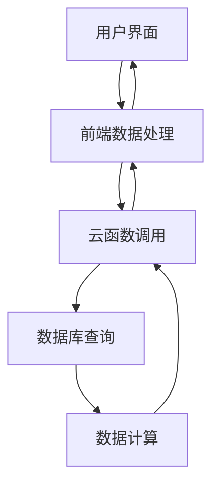

# 数据中心技术实现分析文档

## 1. 整体架构

### 1.1 架构概述

数据中心系统采用前后端分离的架构设计，前端负责数据可视化和用户交互，后端负责数据处理和计算。系统整体架构如下：



### 1.2 模块划分

| 模块 | 职责 | 实现文件 | 技术栈 |
|------|------|----------|--------|
| 前端界面 | 数据可视化和用户交互 | miniprogram/pages/merchant/datacenter/ | 微信小程序原生 |
| 前端数据处理 | 数据动画和图表绘制 | miniprogram/pages/merchant/datacenter/datacenter.js | JavaScript, Canvas API |
| 后端数据处理 | 数据计算和聚合 | cloudfunctions/getDataCenterStats/index.js | Node.js, 微信云开发 |
| 数据存储 | 订单和商品数据 | 微信云数据库 | NoSQL |

## 2. 核心功能模块

### 2.1 时间维度切换

**功能说明**：用户可以选择不同的时间维度（年、月、周、日）来查看数据，系统会根据选择的维度重新计算和展示数据。

**实现原理**：
- 前端通过 `period-tabs` 组件提供时间维度选择
- 点击不同维度时调用 `onPeriodChange` 方法
- 后端根据传入的 `period` 参数生成不同的时间范围和数据桶

**关键代码分析**：
- 前端时间维度切换处理：
```javascript
onPeriodChange(event) {
  const { period } = event.currentTarget.dataset;
  if (!period || period === this.data.activePeriod) {
    return;
  }

  this.loadDataCenter(period);
}
```
- 后端时间范围生成：
```javascript
function createRange(period, now) {
  if (period === 'year') {
    const start = getStartOfYear(now);
    const end = new Date(now.getFullYear() + 1, 0, 1);
    const buckets = Array.from({ length: 12 }, (_, monthIndex) => ({
      label: `${monthIndex + 1}月`,
      start: new Date(now.getFullYear(), monthIndex, 1),
      end: new Date(now.getFullYear(), monthIndex + 1, 1)
    }));

    return {
      start,
      end,
      periodLabel: `${now.getFullYear()}年`,
      xAxisTitle: '月份',
      buckets
    };
  }
  // 其他时间维度处理...
}
```

### 2.2 核心指标展示

**功能说明**：展示总收入、总成本和总利润三个核心指标，支持数据动画效果。

**实现原理**：
- 前端通过 `summaryCards` 组件展示核心指标
- 使用 `animateSummary` 方法实现数字动画效果
- 后端计算并返回汇总数据

**关键代码分析**：
- 前端数字动画实现：
```javascript
animateSummary(summary, periodKey) {
  this.clearNumberAnimation();

  const duration = 680;
  const startedAt = Date.now();

  const tick = () => {
    const progress = Math.min((Date.now() - startedAt) / duration, 1);
    const easedProgress = 1 - Math.pow(1 - progress, 3);
    const current = {
      revenue: summary.revenue * easedProgress,
      cost: summary.cost * easedProgress,
      profit: summary.profit * easedProgress
    };

    this.setData({
      activePeriod: periodKey,
      summaryCards: this.formatSummaryCards(current)
    });

    if (progress >= 1) {
      this.animationTimer = null;
    } else {
      this.animationTimer = setTimeout(tick, 16);
    }
  };

  tick();
}
```
- 后端数据汇总计算：
```javascript
const summary = points.reduce((result, point) => {
  result.revenue += point.revenue;
  result.cost += point.cost;
  result.profit += point.profit;
  return result;
}, { revenue: 0, cost: 0, profit: 0 });
```

### 2.3 趋势图表分析

**功能说明**：通过折线图展示不同时间维度下的收入、成本和利润趋势，支持图表动画效果。

**实现原理**：
- 使用 Canvas API 绘制趋势图表
- 实现了平滑的图表动画效果
- 支持不同时间维度的数据展示

**关键代码分析**：
- 前端图表绘制：
```javascript
drawChart() {
  if (!this.chartCanvas || !this.chartContext || !this.chartSize) {
    return;
  }

  const { width, height } = this.chartSize;
  const ctx = this.chartContext;
  const chart = this.chartPayload || { points: [], yMax: 0 };
  const points = Array.isArray(chart.points) ? chart.points : [];
  const animationProgress = typeof this.chartAnimationProgress === 'number'
    ? this.chartAnimationProgress
    : 1;

  ctx.clearRect(0, 0, width, height);
  this.drawChartBackground(ctx, width, height);

  if (!points.length) {
    this.drawChartEmptyState(ctx, width, height);
    return;
  }

  const padding = { top: 24, right: 16, bottom: 38, left: 56 };
  const chartWidth = width - padding.left - padding.right;
  const chartHeight = height - padding.top - padding.bottom;
  const yMax = chart.yMax > 0 ? chart.yMax : 1;
  const yStepValue = yMax / 4;

  // 绘制网格线和Y轴标签
  // ...

  // 绘制每个指标的折线
  Object.keys(METRIC_STYLES).forEach((metricKey) => {
    this.drawMetricLine({
      ctx,
      metricKey,
      points,
      padding,
      chartWidth,
      chartHeight,
      yMax,
      animationProgress
    });
  });
}
```
- 前端图表动画：
```javascript
startChartAnimation() {
  this.clearChartAnimation();
  const points = this.chartPayload && Array.isArray(this.chartPayload.points)
    ? this.chartPayload.points
    : [];

  if (!points.length) {
    this.chartAnimationProgress = 1;
    this.drawChart();
    return;
  }

  const duration = 1600;
  const startedAt = Date.now();
  this.chartAnimationProgress = 0;

  const tick = () => {
    const progress = Math.min((Date.now() - startedAt) / duration, 1);
    const easedProgress = 1 - Math.pow(1 - progress, 3);
    this.chartAnimationProgress = easedProgress;
    this.drawChart();

    if (progress >= 1) {
      this.chartAnimationTimer = null;
    } else {
      this.chartAnimationTimer = setTimeout(tick, 16);
    }
  };

  tick();
}
```

### 2.4 数据计算逻辑

**功能说明**：根据订单和商品数据计算收入、成本和利润，并按照不同时间维度进行聚合。

**实现原理**：
- 区分预售和现货商品的计算逻辑
- 预售商品：取货后计入数据
- 现货商品：下单时计入数据
- 按时间维度对数据进行聚合

**关键代码分析**：
- 后端数据计算逻辑：
```javascript
orders.forEach((order) => {
  const orderDate = normalizeDate(order.paytime || order.createdAt || order.updatedAt);
  const goods = Array.isArray(order.goods) ? order.goods : [];

  goods.forEach((item) => {
    if (!item) return;

    const goodsInfo = resolveGoodsInfo(item, goodsInfoMap) || {};
    const goodsType = goodsInfo.type || '';
    const goodsTypeNormalized = String(goodsType).toLowerCase();
    const unitCost = Number(goodsInfo.cost || 0) || 0;

    const quantity = Number(item.quantity) || 0;
    const price = Number(item.price) || 0;
    const revenueDelta = price * quantity;
    const costDelta = unitCost * quantity;
    const profitDelta = revenueDelta - costDelta;

    if (goodsTypeNormalized === 'preorder' || goodsTypeNormalized.includes('preorder') || goodsTypeNormalized.includes('预定')) {
      // 预售：等取货后才计入（与库存从 totalBooked 减少一致）
      const pickupStatus = item.pickupStatus;
      if (pickupStatus !== '已取货' && pickupStatus !== '已完成') return;

      const pickupDate = normalizeDate(item.pickuptime || item.pickupTime || null);
      if (!pickupDate) return;
      if (pickupDate < range.start || pickupDate >= range.end) return;

      const bucketIndex = locateBucket(pickupDate, range.buckets);
      if (bucketIndex < 0) return;

      points[bucketIndex].revenue += revenueDelta;
      points[bucketIndex].cost += costDelta;
      points[bucketIndex].profit += profitDelta;
      return;
    }

    // 现货/特价：按下单时间计入（对应买家下单时库存变动）
    if (!orderDate) return;
    const orderBucketIndex = locateBucket(orderDate, range.buckets);
    if (orderBucketIndex < 0) return;

    points[orderBucketIndex].revenue += revenueDelta;
    points[orderBucketIndex].cost += costDelta;
    points[orderBucketIndex].profit += profitDelta;
  });
});
```

## 3. 技术实现细节

### 3.1 前端实现

#### 3.1.1 页面结构

前端页面采用卡片式布局，主要包含以下部分：
- 时间维度选择区：提供年、月、周、日四个时间维度的选择
- 核心指标展示区：展示总收入、总成本和总利润三个核心指标
- 趋势图表区：通过折线图展示数据趋势

**页面结构**：`datacenter.wxml`

#### 3.1.2 图表绘制

使用 Canvas API 实现趋势图表，主要功能包括：
- 背景渐变效果：使用线性渐变和径向渐变创建视觉效果
- 网格线绘制：绘制水平网格线和Y轴标签
- 折线图绘制：绘制收入、成本和利润三条折线
- 区域填充：为每条折线下方添加渐变填充
- 数据点标记：在折线上添加数据点标记

**关键实现**：
- 背景绘制：
```javascript
drawChartBackground(ctx, width, height) {
  const gradient = ctx.createLinearGradient(0, 0, width, height);
  gradient.addColorStop(0, '#ffffff');
  gradient.addColorStop(1, '#f5f5f5');

  ctx.save();
  ctx.fillStyle = gradient;
  ctx.fillRect(0, 0, width, height);

  const glow = ctx.createRadialGradient(width * 0.78, height * 0.18, 0, width * 0.78, height * 0.18, width * 0.44);
  glow.addColorStop(0, 'rgba(79, 107, 255, 0.08)');
  glow.addColorStop(1, 'rgba(79, 107, 255, 0)');
  ctx.fillStyle = glow;
  ctx.fillRect(0, 0, width, height);
  ctx.restore();
}
```

- 折线绘制：
```javascript
drawMetricLine({ ctx, metricKey, points, padding, chartWidth, chartHeight, yMax, animationProgress }) {
  const style = METRIC_STYLES[metricKey];
  const coordinates = points.map((item, index) => ({
    x: this.getPointX(index, points.length, padding.left, chartWidth),
    y: padding.top + chartHeight - (Math.max(item[metricKey] || 0, 0) / yMax) * chartHeight,
    value: item[metricKey] || 0
  }));
  const animatedCoordinates = this.getAnimatedCoordinates(coordinates, animationProgress);

  if (!coordinates.length || !animatedCoordinates.length) {
    return;
  }

  // 绘制区域填充
  ctx.save();
  const areaGradient = ctx.createLinearGradient(0, padding.top, 0, padding.top + chartHeight);
  areaGradient.addColorStop(0, this.hexToRgba(style.color, 0.14));
  areaGradient.addColorStop(1, this.hexToRgba(style.color, 0));
  ctx.beginPath();
  animatedCoordinates.forEach((point, index) => {
    if (index === 0) {
      ctx.moveTo(point.x, point.y);
    } else {
      ctx.lineTo(point.x, point.y);
    }
  });
  ctx.lineTo(animatedCoordinates[animatedCoordinates.length - 1].x, padding.top + chartHeight);
  ctx.lineTo(animatedCoordinates[0].x, padding.top + chartHeight);
  ctx.closePath();
  ctx.fillStyle = areaGradient;
  ctx.fill();

  // 绘制折线
  ctx.strokeStyle = style.color;
  ctx.lineWidth = 4;
  ctx.lineJoin = 'round';
  ctx.lineCap = 'round';
  ctx.beginPath();

  animatedCoordinates.forEach((point, index) => {
    if (index === 0) {
      ctx.moveTo(point.x, point.y);
    } else {
      ctx.lineTo(point.x, point.y);
    }
  });

  ctx.stroke();

  // 绘制数据点
  const visiblePointCount = Math.max(0, animatedCoordinates.length - 1);
  coordinates.slice(0, visiblePointCount).forEach((point) => {
    ctx.beginPath();
    ctx.fillStyle = '#ffffff';
    ctx.arc(point.x, point.y, 4.8, 0, Math.PI * 2);
    ctx.fill();
    ctx.beginPath();
    ctx.fillStyle = style.color;
    ctx.arc(point.x, point.y, 2.6, 0, Math.PI * 2);
    ctx.fill();
  });

  ctx.restore();
}
```

#### 3.1.3 动画效果

实现了两种动画效果：
- 数字增长动画：使用缓动函数实现平滑的数字增长效果
- 图表绘制动画：实现折线图的渐进式绘制效果

**关键实现**：
- 数字动画：`datacenter.js:383-411`
- 图表动画：`datacenter.js:420-450`

### 3.2 后端实现

#### 3.2.1 云函数设计

使用微信云函数 `getDataCenterStats` 处理数据计算，主要功能包括：
- 权限验证：确保只有商家角色可以访问
- 时间范围生成：根据选择的时间维度生成对应的时间范围
- 数据查询：从数据库获取订单和商品数据
- 数据计算：计算收入、成本和利润
- 数据聚合：按时间维度对数据进行聚合

**关键实现**：
- 权限验证：
```javascript
async function assertMerchant(openid) {
  const userRes = await db.collection('users').where({ openid }).limit(1).get();
  const user = (userRes.data || [])[0];

  if (!user || user.role !== 'merchant') {
    throw new Error('无权限访问数据中心');
  }
}
```

- 数据查询：
```javascript
async function fetchAll(collectionName) {
  const countRes = await db.collection(collectionName).count();
  const total = countRes.total || 0;

  if (total === 0) {
    return [];
  }

  const tasks = [];
  for (let skip = 0; skip < total; skip += PAGE_SIZE) {
    tasks.push(
      db.collection(collectionName)
        .skip(skip)
        .limit(PAGE_SIZE)
        .get()
    );
  }

  const pages = await Promise.all(tasks);
  return pages.flatMap((page) => page.data || []);
}
```

#### 3.2.2 数据处理逻辑

**时间范围计算**：
- 年：生成12个月份的数据桶
- 月：生成当月每天的数据桶
- 周：生成周一到周日的数据桶
- 日：生成24小时的数据桶

**数据计算**：
- 遍历订单和商品数据
- 区分预售和现货商品的处理逻辑
- 按时间桶聚合数据
- 计算汇总数据

**关键实现**：`getDataCenterStats/index.js:212-310`

## 4. 数据流分析

### 4.1 数据请求流程

1. 用户访问数据中心页面
2. 前端调用 `loadDataCenter` 方法
3. 前端向云函数 `getDataCenterStats` 发送请求
4. 云函数验证用户权限
5. 云函数查询数据库获取订单和商品数据
6. 云函数计算并聚合数据
7. 云函数返回处理后的数据
8. 前端接收数据并更新界面
9. 前端执行动画效果

### 4.2 数据结构

**前端数据结构**：
- `summaryCards`：核心指标数据，包含总收入、总成本和总利润
- `chartPayload`：图表数据，包含各个时间点的收入、成本和利润
- `chartMeta`：图表元数据，包含时间范围标签和X轴标题

**后端数据结构**：
- `summary`：汇总数据，包含总收入、总成本和总利润
- `chart`：图表数据，包含Y轴最大值和各个时间点的数据
- `periodLabel`：时间范围标签
- `xAxisTitle`：X轴标题

## 5. 技术亮点

### 5.1 前端技术亮点

1. **Canvas 图表实现**：使用原生 Canvas API 实现了功能完整的趋势图表，包括渐变背景、网格线、折线、区域填充和数据点标记。

2. **平滑动画效果**：实现了数字增长动画和图表绘制动画，使用缓动函数（`1 - Math.pow(1 - progress, 3)`）实现平滑的动画效果，提升了用户体验。

3. **响应式设计**：页面布局适应不同屏幕尺寸，使用弹性布局和网格布局确保在各种设备上都有良好的显示效果。

4. **错误处理**：完善的错误处理机制，确保在数据加载失败时能够优雅降级，显示默认数据并提示用户。

5. **性能优化**：
   - 使用 `requestAnimationFrame` 实现流畅的动画效果
   - 避免不必要的重渲染
   - 优化 Canvas 绘制性能

### 5.2 后端技术亮点

1. **时间维度处理**：灵活的时间维度处理逻辑，支持年、月、周、日四种时间维度的数据聚合，使用不同的时间桶策略。

2. **数据计算准确性**：区分预售和现货商品的计算逻辑，预售商品在取货后计入数据，现货商品在下单时计入数据，确保数据计算的准确性。

3. **性能优化**：
   - 使用批量查询和并行处理提高数据处理效率
   - 优化数据结构，减少数据传输量
   - 使用索引优化数据库查询性能

4. **权限控制**：实现了基于用户角色的权限控制，确保只有商家可以访问数据中心，提高系统安全性。

5. **代码健壮性**：
   - 完善的错误处理机制
   - 数据类型检查和转换
   - 边界情况处理

## 6. 代码优化建议

### 6.1 前端优化

1. **Canvas 性能优化**：
   - 考虑使用离屏 Canvas 进行绘制，减少主界面的重绘
   - 优化动画帧率，避免过度绘制
   - 合理使用 `requestAnimationFrame` 代替 `setTimeout`

2. **数据缓存**：
   - 实现数据缓存机制，避免重复请求相同时间维度的数据
   - 考虑使用本地存储缓存数据，提高页面加载速度
   - 实现数据预加载，提升用户体验

3. **代码结构优化**：
   - 将图表绘制逻辑封装为独立组件
   - 优化事件处理函数，减少不必要的重渲染
   - 使用模块化设计，提高代码可维护性

4. **用户体验优化**：
   - 添加加载状态和错误提示
   - 实现数据刷新机制
   - 优化图表交互，添加数据点悬停效果

### 6.2 后端优化

1. **数据库查询优化**：
   - 使用索引优化数据库查询性能
   - 考虑使用聚合查询减少数据传输量
   - 实现数据分页，避免一次性查询大量数据

2. **计算逻辑优化**：
   - 优化数据计算逻辑，减少不必要的计算
   - 考虑使用缓存存储计算结果，提高响应速度
   - 实现增量计算，减少重复计算

3. **错误处理增强**：
   - 增强错误处理机制，提供更详细的错误信息
   - 实现重试机制，提高系统稳定性
   - 添加监控和日志记录

4. **扩展性优化**：
   - 设计可扩展的数据模型
   - 实现插件化架构，支持添加新的数据源
   - 考虑添加数据导出功能

## 7. 总结

数据中心系统通过前后端分离的架构设计，实现了功能完整、性能优异的数据可视化系统。前端使用 Canvas API 实现了美观的图表和动画效果，后端实现了准确的数据计算和聚合逻辑。系统支持多种时间维度的数据展示，能够帮助商家全面了解门店的经营状况。

### 7.1 系统价值

1. **数据驱动决策**：通过数据中心，商家可以直观地了解门店的经营状况，基于数据做出更明智的决策。

2. **运营效率提升**：实时掌握销售数据，及时调整运营策略，提高运营效率。

3. **成本控制**：通过成本分析，识别成本增长点，优化成本结构。

4. **业务增长**：通过销售趋势分析，发现业务增长机会，制定增长策略。

### 7.2 技术价值

1. **前端技术**：展示了如何使用 Canvas API 实现复杂的图表和动画效果，为类似需求提供了参考。

2. **后端技术**：展示了如何使用云函数实现数据处理和聚合，为类似需求提供了参考。

3. **架构设计**：展示了前后端分离的架构设计，为类似系统的开发提供了参考。

4. **性能优化**：展示了如何优化前端和后端性能，为类似系统的优化提供了参考。

通过本技术分析文档，开发团队可以深入理解数据中心的架构设计、核心功能和实现细节，为后续的功能扩展和性能优化提供参考。